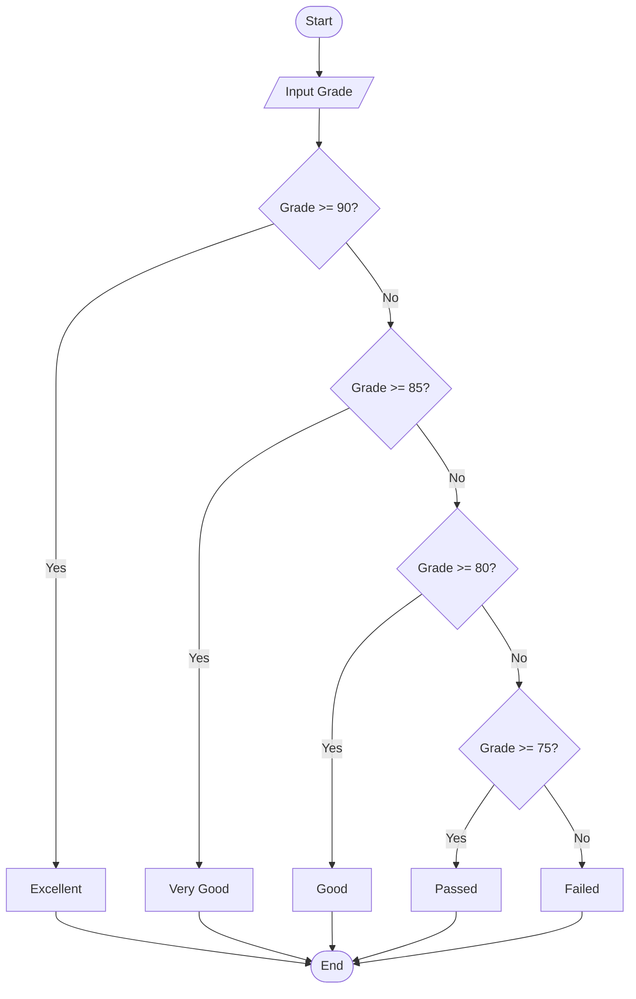

```mermaid
flowchart TD
    A([Start])
    B[/Input Grade/]
    C{Grade >= 90?}
    D[Excellent]
    E{Grade >= 85?}
    F[Very Good]
    G{Grade >= 80?}
    H[Good]
    I{Grade >= 75?}
    J[Passed]
    K[Failed]
    L([End])

    A --> B
    B --> C
    C -->|Yes| D
    C -->|No| E
    E -->|Yes| F
    E -->|No| G
    G -->|Yes| H
    G -->|No| I
    I -->|Yes| J
    I -->|No| K

    D --> L
    F --> L
    H --> L
    J --> L
    K --> L
```
