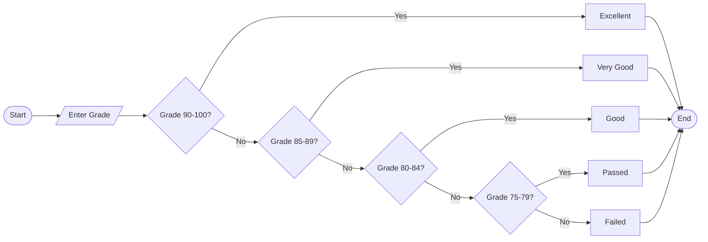

```mermaid
flowchart LR
    A([Start]) --> B[/Enter Grade/]
    B --> C{Grade 90-100?}
    C -->|Yes| D[Excellent]
    C -->|No| E{Grade 85-89?}
    E -->|Yes| F[Very Good]
    E -->|No| G{Grade 80-84?}
    G -->|Yes| H[Good]
    G -->|No| I{Grade 75-79?}
    I -->|Yes| J[Passed]
    I -->|No| K[Failed]
    D --> L([End])
    F --> L
    H --> L
    J --> L
    K --> L
```
